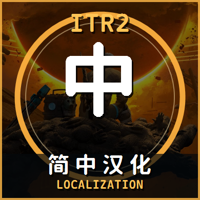

<p align="center">
  
  <br><br>
  <b>Into the Radius 2 · Simplified Chinese Localization</b>
  <br>
  <i>Non-profit Community Localization Project</i>
</p>

<p align="center">
  <a href="README.md">中文</a> | <a href="README_EN.md">English</a>
</p>

<p align="center">
  
  
  
  
</p>

This project makes use of AI agents in its translation workflow.

If you'd like to run your own agent-assisted translation workflow, the translation constraints are documented and can be integrated into your preferred agent's rule set:

```markdown
## Translation Guidelines

See [notes/translation_guidelines.md](notes/translation_guidelines.md).
```

## Current Workflow

This workspace uses the latest `EnglishSource.uasset` as the single source of truth.

Build pipeline:

1. Read the current in-game English source text from `notes/english_source_current_probe.csv`.
2. Generate or refresh `translation/ITR2_CN_master.csv`.
3. Recalculate the Unreal `StrCrc32` source hash for each entry.
4. Generate `Localization/Game/en/Game.locres` from the master CSV.
5. Inject additional blueprint keys not present in EnglishSource.
6. Package the `.pak` and produce a Vortex/Nexus-compatible zip to `dist/`.

## Key Files

- `translation/ITR2_CN_master.csv` — The single authoritative translation table. Edit this first.
- `build/reports/ITR2_CN_built_locres_audit.csv` — Post-build reverse-read audit from the generated Chinese locres. Not the original game locres.
- `notes/english_source_current_probe.csv` — Current EnglishSource export.
- `notes/original_current_locres_probe.csv` — Original game locres export. Reference only; should not match the built Chinese locres.
- `dist/` — Release zip output directory.
- `VERSION` — Version number used for the next default build; auto-incremented on success.

## Rebuilding

```powershell
pwsh.exe -NoLogo -NoProfile -File .\scripts\build_chs_pak.ps1
```

Default output:

- `build/z_IntoTheRadius2_SimplifiedChinese_Localization_P.pak`
- `dist/IntoTheRadius2_SimplifiedChinese_Localization_<VERSION>.zip`

Without `-Version`, the script reads the `VERSION` file and auto-increments it after a successful build. Roll-over rules: `v0.3.9 → v0.4.0`, `v0.9.9 → v1.0.0`.

To specify a version:

```powershell
pwsh.exe -NoLogo -NoProfile -File .\scripts\build_chs_pak.ps1 -Version v0.3.1
```

A manual `-Version` only affects the current output and does not advance the `VERSION` file.

## CSV Maintenance

Edit the `new_translation` column in `translation/ITR2_CN_master.csv`.

Column order:

```text
text, new_translation, notes, key, source_hash, row_no, category, source
```

The game reads from `new_translation` at runtime.

`build/reports/ITR2_CN_built_locres_audit.csv` closely mirrors `new_translation`, as it's reverse-read from the freshly generated Chinese locres. To view the original game locres, refer to `notes/original_current_locres_probe.csv`.

## Installation

**Manual:** Extract the `.pak` from the dist zip into:

```text
IntoTheRadius2\Content\Paks\
```

**Vortex:** Upload or import the dist zip directly. The zip root contains the pak file and `LICENSES/MapleMono-OFL.txt` (font license).

## Known Issues

1. The current game version has the left/right labels for the IZh-27 6-round shell strip swapped. This mod compensates in the translated text to match in-game display. If the devs fix this, the strip names may become misaligned until an update is released.
2. There are 2 spots in the build pipeline where I couldn't override the translated text — still debugging, but it doesn't affect gameplay:
   

## Free & License Disclaimer

1. **Completely Free:** This mod is a non-profit community localization effort, released entirely free of charge.
2. **No Commercial Use:** Licensed under [CC BY-NC-SA 4.0](https://creativecommons.org/licenses/by-nc-sa/4.0/). **All commercial use of this mod or derivative works is strictly prohibited** (including but not limited to resale, paywalled downloads, bundled paid content, tip-gated access, or subscriber-exclusive distribution).
3. **Consumer Warning:** If you paid for this mod on any platform (Taobao, Xianyu, Pinduoduo, etc.), you were scammed. Demand a refund and report the seller immediately. DMCA/IPP takedowns will be pursued against unauthorized commercial redistribution.

## Credits

- Maple Mono NF CN font — [subframe7536](https://github.com/subframe7536/maple-font), SIL Open Font License 1.1
- Into the Radius 2 — [CM Games](https://cm.games/)

## Screenshots


